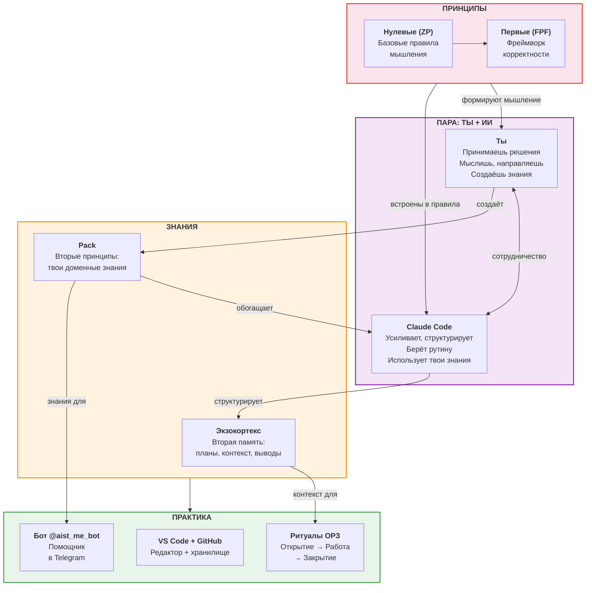
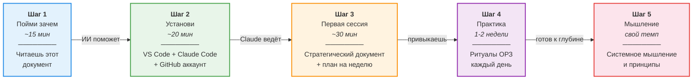
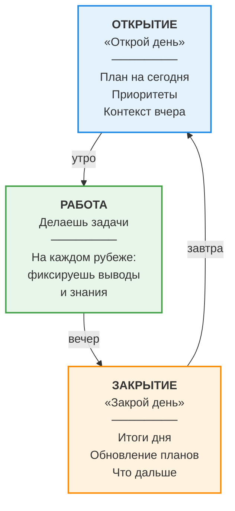
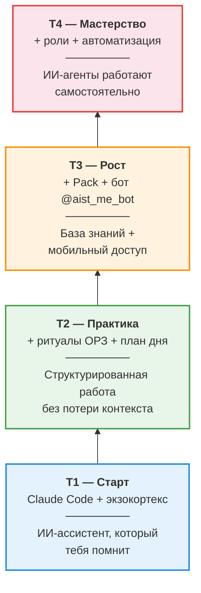
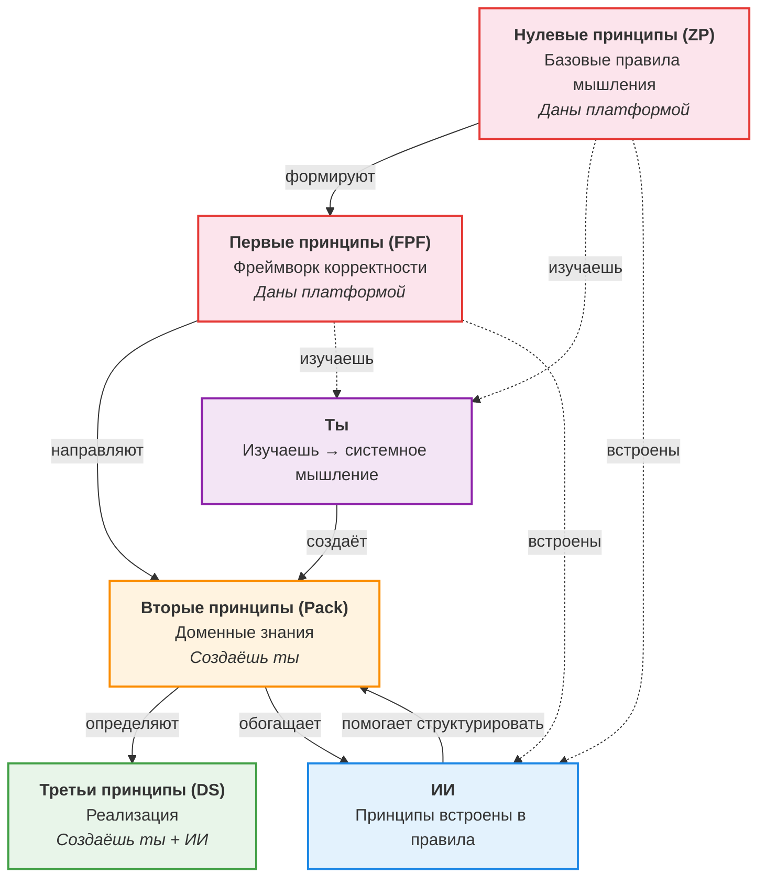
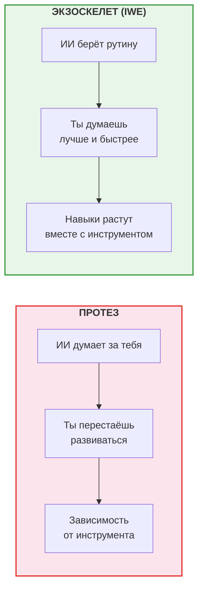
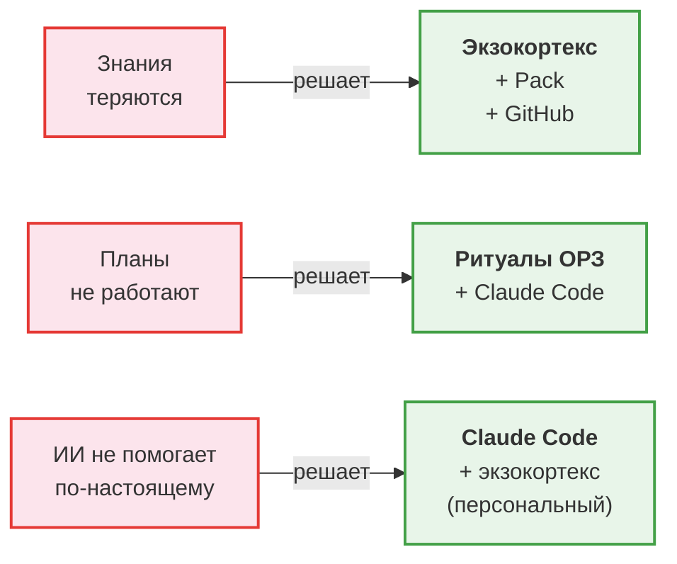

# Визуальные схемы IWE для новичков

> Схемы в формате Mermaid. Рендерятся в GitHub, VS Code (с расширением Mermaid), и большинстве Markdown-редакторов.

---

## Схема 1. Карта компонентов IWE

> Ты в центре. Принципы — общий фундамент для тебя и ИИ. Знания создаёшь ты — и они обогащают обоих.

---

## Схема 2. Путь пользователя: от нуля до рабочего IWE

> Пять шагов. Каждый — конкретный результат.

---

## Схема 3. Ритуал ОРЗ (ежедневный цикл)

> Один паттерн для дня и для каждой рабочей сессии.

---

## Схема 4. Уровни освоения (тиры)

> Начинай с T1. Добавляй компоненты по мере готовности.

---

## Схема 5. Иерархия принципов — кто создаёт, кто использует

> Принципы текут сверху вниз. Знания — снизу вверх (от твоего опыта обратно в Pack).

---

## Схема 6. Экзоскелет vs Протез

> Ключевое различение IWE: ИИ **усиливает** мышление, а не **заменяет** его.

---

## Схема 7. Проблема → Решение

> Связь между типичными проблемами и компонентами IWE.

---

*Создан: 2026-03-17 | WP-120 | [FMT-exocortex-template](https://github.com/TserenTserenov/FMT-exocortex-template)*
