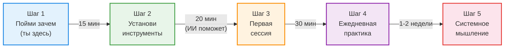
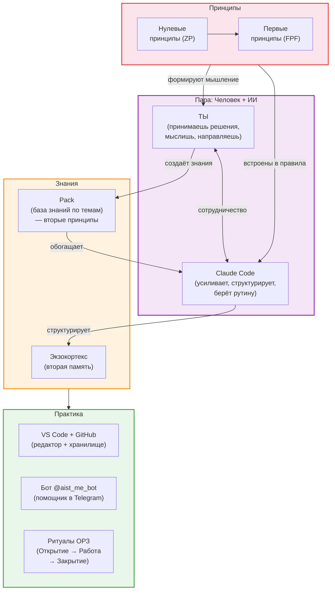
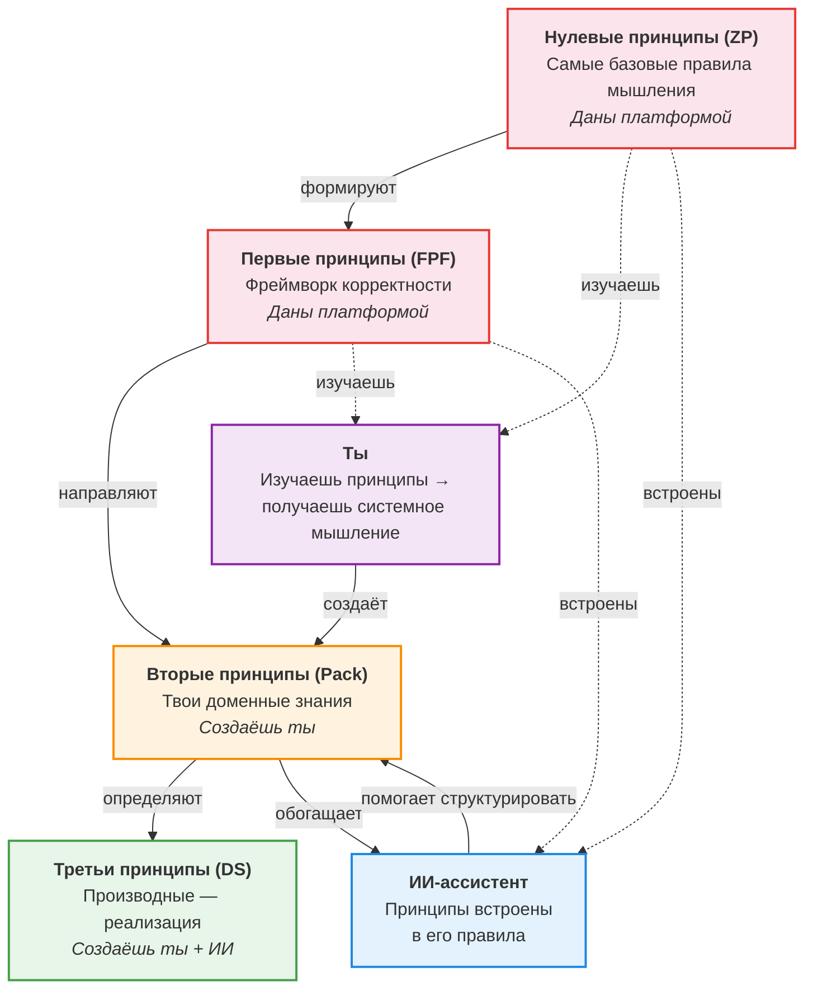

# IWE для новичков: твоя интеллектуальная рабочая среда

> **Для кого:** Для тех, кто впервые слышит об IWE и не знает, что такое GitHub, VS Code или командная строка. Это нормально. Ты в правильном месте.
>
> **Что получишь:** Понимание того, что такое IWE, из чего она состоит, зачем нужна — и как начать, не будучи программистом.

---

## 1. Твоя проблема (и она реальна)

Узнаёшь себя?

**Знания теряются.** Ты читаешь книгу, слушаешь лекцию, делаешь заметки — а через месяц не можешь найти ту самую мысль. Или находишь, но не помнишь контекст. Заметки в Notion, блокноте, телефоне, на салфетке — везде и нигде.

**Планы не работают.** Ты составляешь план на неделю, а к среде он уже неактуален. Новые задачи вытесняют старые. Нет системы приоритетов, нет ревью — только ощущение, что ничего не успеваешь.

**ИИ не помогает по-настоящему.** Ты пробовал ChatGPT или Claude — получал красивые, но общие ответы. Каждый раз начинаешь с нуля. ИИ не знает о тебе ничего: ни о твоих проектах, ни о твоих целях, ни о том, что ты уже пробовал.

---

## 2. Как IWE это решает

IWE — это **Intellectual Work Environment**, интеллектуальная рабочая среда. Не программа, которую устанавливаешь одной кнопкой. Это набор инструментов, которые работают вместе — как кухня, где каждый предмет на своём месте.

| Проблема | Компонент IWE | Как работает |
|----------|--------------|-------------|
| Знания теряются | **Экзокортекс + Pack** | Каждая единица знания — в своём месте. ИИ помогает извлекать и структурировать. История изменений хранится в GitHub |
| Планы не работают | **Ритуалы ОРЗ + Claude Code** | Утром — план дня (автоматически). Вечером — итоги. Каждую неделю — ревью. ИИ не даёт забыть незавершённое |
| ИИ не помогает | **Claude Code + Экзокортекс** | ИИ читает ТВОИ файлы, знает ТВОИ цели, помнит ТВОЮ историю. Это персональный ассистент, а не обезличенный чат-бот |

> Подробнее о каждом сценарии: [Планирование дня](https://github.com/TserenTserenov/PACK-digital-platform/blob/main/pack/digital-platform/08-use-cases/DP.SC.001-daily-planning.md) | [Планирование недели](https://github.com/TserenTserenov/PACK-digital-platform/blob/main/pack/digital-platform/08-use-cases/DP.SC.002-weekly-planning.md) | [Развитие и обучение](https://github.com/TserenTserenov/PACK-digital-platform/blob/main/pack/digital-platform/08-use-cases/DP.SC.003-learning-and-development.md) | [Захват знаний](https://github.com/TserenTserenov/PACK-digital-platform/blob/main/pack/digital-platform/08-use-cases/DP.SC.004-knowledge-capture.md)

---

## 3. Твой путь: от нуля до рабочего IWE

### Шаг 1. Пойми зачем (ты уже здесь)

Ты читаешь этот документ — значит, первый шаг сделан. Ты понимаешь, что текущий способ работы с информацией не масштабируется. Это важное осознание.

### Шаг 2. Установи инструменты (~20 минут)

Тебе **не нужно** разбираться в программировании. Установка IWE — это три действия:

1. Установить Claude Code (бесплатно)
2. Создать аккаунт на GitHub (бесплатно)
3. Запустить одну команду, которая настроит всё остальное

> **ИИ поможет.** Если ты уже поставил Claude Code — просто скажи ему: «Помоги мне установить IWE». Он проведёт тебя через каждый шаг.
>
> Подробная инструкция: [SETUP-GUIDE.md](../SETUP-GUIDE.md)

**Что нужно (минимум):**
- Компьютер (Mac, Linux или Windows с WSL)
- Подписка Claude Pro (~$20/мес) — для Claude Code
- GitHub аккаунт (бесплатно)

### Шаг 3. Первая стратегическая сессия (~30 минут)

После установки ты запускаешь Claude Code и проводишь первую сессию:
- Заполняешь стратегический документ (кто ты, что важно, куда двигаешься)
- Формулируешь 3-5 рабочих продуктов (задач) на ближайшую неделю
- ИИ структурирует это в план

Это не абстрактное упражнение — ты сразу получаешь работающий план.

> Подробнее: [SETUP-GUIDE.md, этап 2](../SETUP-GUIDE.md)

### Шаг 4. Ежедневная практика (1-2 недели)

Каждый день — один и тот же ритм:
- **Утро:** «Открой день» → Claude показывает план, события, на чём остановился
- **Работа:** Работаешь, фиксируешь выводы на рубежах
- **Вечер:** «Закрой день» → Claude записывает итоги, обновляет планы

Через неделю ты почувствуешь разницу: ничего не теряется, всё на своих местах.

> Подробнее: [LEARNING-PATH.md, §5 — Повседневная работа](../LEARNING-PATH.md)

### Шаг 5. Системное мышление (когда будешь готов)

После 1-2 недель практики ты заметишь, что IWE — это больше, чем инструменты. Она построена на определённых принципах. Освоение этих принципов — следующий уровень. Подробнее — в [разделе 6](#6-карта-iwe-что-внутри).

---

## 4. Не бойся

### «Я не программист»

Ты и не должен быть. IWE — среда для интеллектуальной работы, не для программирования. Ты пишешь тексты, планы, заметки. GitHub — просто надёжное хранилище. Ты не будешь писать код.

### «GitHub, CLI, терминал — это страшно»

Только в первый раз. Вот что тебе реально нужно знать:
- **GitHub** — место, где хранятся файлы (как Google Drive, но с историей)
- **Терминал** — окно, в которое ты вводишь команды текстом (Claude Code подскажет, что вводить)
- **CLI** — просто способ общения с компьютером через текст вместо кнопок

После установки ты будешь взаимодействовать в основном с Claude Code — на обычном русском языке.

### «Это слишком сложная система»

IWE — это не монолит, который нужно освоить целиком. Это модульная среда. Ты начинаешь с минимума и добавляешь по мере надобности:

| Уровень | Что используешь | Что получаешь |
|---------|----------------|---------------|
| **T1 — Старт** | Claude Code + экзокортекс | Персональный ИИ-ассистент, который тебя помнит |
| **T2 — Практика** | + ритуалы ОРЗ + план дня | Структурированная работа без потери контекста |
| **T3 — Рост** | + Pack + бот | База знаний + мобильный доступ |
| **T4 — Мастерство** | + роли + автоматизация | ИИ-агенты, которые работают самостоятельно |

> Подробнее о тирах: [LEARNING-PATH.md, §9 — Платформа и тиры](../LEARNING-PATH.md)

### «ИИ сделает всё за меня?»

Нет. И это принципиально. IWE — это **экзоскелет, а не протез**.

- **Протез** заменяет способность. Ты перестаёшь думать, потому что ИИ думает за тебя.
- **Экзоскелет** усиливает способность. Ты думаешь лучше, потому что ИИ берёт на себя рутину: напоминает, структурирует, находит связи.

Твоё мышление — главный ресурс. ИИ помогает его не растрачивать на поиск файла или восстановление контекста.

> Подробнее: [Принципы vs Навыки](../principles-vs-skills.md)

---

## 5. Зачем каждый компонент

### Ты + Claude Code = пара

В центре IWE — **ты**. Ты принимаешь решения, мыслишь, направляешь. Claude Code — твой напарник: он усиливает, структурирует, берёт на себя рутину. Но решения — всегда за тобой.

Вы оба работаете на одних и тех же **принципах**: нулевые и первые принципы (ZP, FPF) встроены в правила ИИ и одновременно формируют твоё системное мышление. А знания, которые ты создаёшь (вторые принципы, Pack), обогащают и тебя, и ИИ.

### Инструменты

**Claude Code** — это ИИ-ассистент, который работает прямо в терминале. Он не просто отвечает на вопросы — он читает твои файлы, помогает планировать, напоминает о незавершённых делах, предлагает структуру. Это твой напарник, а не поисковик.

**GitHub** — облачное хранилище для всех твоих файлов. Главное преимущество: полная история изменений. Ты всегда можешь вернуться к любой версии любого файла. Это как автосохранение, но на каждое изменение.

**VS Code** — бесплатный редактор от Microsoft. На старте тебе он не нужен — Claude Code работает в терминале, и ты общаешься с ним текстом. VS Code понадобится позже, когда захочешь самостоятельно просматривать и редактировать файлы. Думай о нём как о «продвинутом блокноте» для своих текстов и планов.

### Знания

**Экзокортекс** — твоя вторая память. Набор файлов, которые ИИ-ассистент (Claude Code) читает и обновляет. Когда ты начинаешь работу — он знает, на чём ты остановился вчера. Когда заканчиваешь — записывает выводы. Ты больше не теряешь контекст между сессиями.

**Pack** — база знаний по предметной области. Если ты изучаешь, например, маркетинг — твои выжимки, правила, различения складываются в Pack. Это не папка с закладками, а структурированная библиотека, где каждая единица знания — на своём месте.

### Практика

**Бот @aist_me_bot** — помощник в Telegram. Отвечает на вопросы по твоей базе знаний, напоминает о задачах, помогает с самоконтролем. Не нужно открывать компьютер, чтобы оставаться на связи с IWE.

**Ритуалы ОРЗ** (Открытие → Работа → Закрытие) — простой паттерн, который повторяется на каждом масштабе. Начинаешь день — Открытие (что сегодня делаю?). Работаешь — Работа (фиксирую знания на рубежах). Заканчиваешь — Закрытие (что сделал, что дальше). То же самое для каждой рабочей сессии.

Подробнее о принципах — в [следующем разделе](#6-карта-iwe-что-внутри).

---

## 6. Карта IWE: что внутри

Теперь, когда ты знаешь зачем каждый компонент — вот как они связаны:

**Пять блоков — и ты в центре:**

| Блок | Что это | Простая аналогия |
|------|---------|-----------------|
| **Принципы** | Нулевые и первые принципы — фундамент мышления. Их изучаешь ты, их использует ИИ | Чертёж дома (без него — стройка наугад) |
| **Ты** | Принимаешь решения, мыслишь, создаёшь знания. ИИ без тебя — просто программа | Архитектор |
| **Claude Code** | ИИ-напарник: усиливает, структурирует, берёт рутину. Работает по тем же принципам | Инженер-помощник |
| **Знания** | Экзокортекс (вторая память) + Pack (твои доменные знания — вторые принципы) | Библиотека с каталогом |
| **Практика** | Инструменты (VS Code, GitHub), бот, ритуалы — ежедневное применение | Расписание + мастерская |

---

## 7. Принципы и системное мышление — фундамент IWE

Ты можешь установить все инструменты, настроить ритуалы, начать вести планы — и всё равно не получить максимум от IWE. Почему?

Потому что IWE построена на **принципах**, а системное мышление — это результат их изучения.

### Иерархия принципов (простыми словами)

В IWE есть четыре уровня принципов — и ты участвуешь в создании половины из них:

| Уровень | Кто создаёт | Кто использует | Пример |
|---------|-------------|---------------|--------|
| **Нулевые (ZP)** | Платформа | Ты + ИИ | Базовые правила мышления |
| **Первые (FPF)** | Платформа | Ты + ИИ | Фреймворк корректности, различения |
| **Вторые (Pack)** | Ты | Ты + ИИ | Твои знания по маркетингу, управлению, инженерии |
| **Третьи (DS)** | Ты + ИИ | Ты + ИИ | Конкретные планы, код, процессы |

### Что такое системное мышление (простыми словами)

Это **результат** изучения принципов. Умение видеть **целое**, а не только части:

- Ты планируешь неделю. Без системного мышления — список задач. С ним — понимание, какие задачи связаны, какая блокирует другую, что важнее стратегически.
- Ты читаешь книгу. Без системного мышления — конспект цитат. С ним — различения и принципы, которые можно применить в разных контекстах.
- Ты используешь ИИ. Без системного мышления — случайные вопросы. С ним — точные запросы, потому что понимаешь структуру своей работы.

### Почему без этого IWE не раскроется

IWE использует конкретные концепции из системного мышления:

| Концепция | Кто использует | Где в IWE | Что это значит |
|-----------|---------------|-----------|----------------|
| **Различения** | Ты + ИИ | Pack, экзокортекс | Точно определить, чем одно отличается от другого |
| **Описания методов** | ИИ (протоколы) + Ты (практика) | Ритуалы ОРЗ | Понимание «как», а не только «что» |
| **Рабочие продукты** | Ты (решаешь) + ИИ (отслеживает) | Планирование, ревью | Фокус на результатах, а не на активностях |
| **Роли** | Ты + ИИ-агенты | Стратег, Экстрактор | Разделение: кто что делает (включая ИИ) |

Ты можешь начать пользоваться IWE **без** глубокого понимания этих концепций. Но чтобы по-настоящему раскрыть потенциал — стоит в них разобраться. И чем больше ты изучаешь — тем умнее становится и твой ИИ-напарник, потому что ты наполняешь Pack знаниями.

### Как начать изучать

1. **Первая неделя:** Просто пользуйся IWE. Привыкни к ритуалам ОРЗ. Не углубляйся в теорию.
2. **Вторая неделя:** Прочитай [Принципы vs Навыки](../principles-vs-skills.md) — это 10-минутное введение в философию IWE.
3. **Далее:** Изучай [LEARNING-PATH.md, §3 — Фундамент мышления](../LEARNING-PATH.md) в своём темпе. Бот @aist_me_bot поможет с вопросами.

> Рекомендуемые курсы по системному мышлению: [Системное саморазвитие](https://system-school.ru/) — курс, на котором IWE родилась.

---

## Ссылки и ресурсы

### Начать сейчас

| Ресурс | Что это | Ссылка |
|--------|---------|--------|
| Пошаговая установка | 7 этапов, от нуля до рабочей IWE | [SETUP-GUIDE.md](../SETUP-GUIDE.md) |
| Путь обучения | Полная программа освоения (11 разделов) | [LEARNING-PATH.md](../LEARNING-PATH.md) |
| Быстрый справочник | FAQ + план на 4 дня | [LEARNING-PATH.md, §11](../LEARNING-PATH.md) |

### Понять глубже

| Ресурс | Что это | Ссылка |
|--------|---------|--------|
| Что такое IWE | Главное определение, архитектура, контуры | [DP.IWE.001](https://github.com/TserenTserenov/PACK-digital-platform/blob/main/pack/digital-platform/02-domain-entities/DP.IWE.001-intelligent-working-environment.md) |
| Шаблон и настройка | Компоненты, роли, FAQ | [DP.IWE.002](https://github.com/TserenTserenov/PACK-digital-platform/blob/main/pack/digital-platform/02-domain-entities/DP.IWE.002-iwe-template-and-setup.md) |
| Принципы vs Навыки | Почему принципы важнее инструментов | [principles-vs-skills.md](../principles-vs-skills.md) |
| Терминология | Словарь IWE | [ONTOLOGY.md](../../ONTOLOGY.md) |

### Сценарии использования

| Сценарий | Обещание | Ссылка |
|----------|----------|--------|
| Планирование дня | DayPlan к 08:00 с приоритетами и контекстом | [DP.SC.001](https://github.com/TserenTserenov/PACK-digital-platform/blob/main/pack/digital-platform/08-use-cases/DP.SC.001-daily-planning.md) |
| Планирование недели | WeekPlan (с секцией «Итоги W{N}») | [DP.SC.002](https://github.com/TserenTserenov/PACK-digital-platform/blob/main/pack/digital-platform/08-use-cases/DP.SC.002-weekly-planning.md) |
| Развитие и обучение | Q&A, проверка ДЗ, марафоны | [DP.SC.003](https://github.com/TserenTserenov/PACK-digital-platform/blob/main/pack/digital-platform/08-use-cases/DP.SC.003-learning-and-development.md) |
| Захват знаний | Fleeting notes → Pack | [DP.SC.004](https://github.com/TserenTserenov/PACK-digital-platform/blob/main/pack/digital-platform/08-use-cases/DP.SC.004-knowledge-capture.md) |

### Совместимость и стоимость

| Параметр | Значение |
|----------|----------|
| ОС | macOS, Linux, Windows (через WSL) |
| Обязательная подписка | Claude Pro (~$20/мес) |
| GitHub | Бесплатно |
| VS Code | Бесплатно (понадобится позже, не на старте) |
| Нужно ли уметь программировать | Нет |

> Подробнее: [PLATFORM-COMPAT.md](../PLATFORM-COMPAT.md) | [FAQ в DP.IWE.002, §11](https://github.com/TserenTserenov/PACK-digital-platform/blob/main/pack/digital-platform/02-domain-entities/DP.IWE.002-iwe-template-and-setup.md)

---

*Создан: 2026-03-17 | WP-120 | [FMT-exocortex-template](https://github.com/TserenTserenov/FMT-exocortex-template)*
